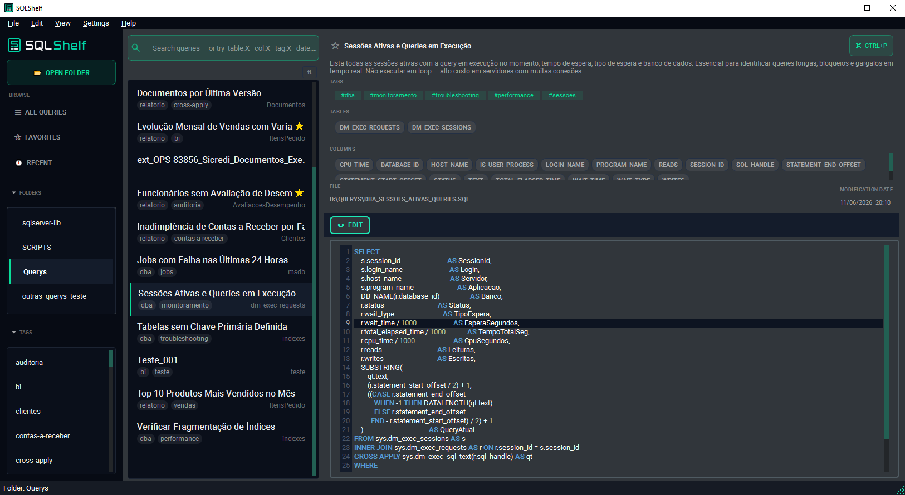
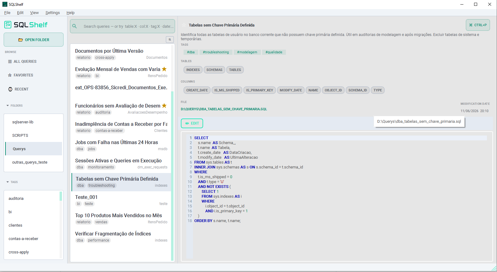

<p align="center">
  
</p>

<p align="center">
  <strong>Open-source desktop SQL query manager</strong><br/>
  Organize, describe, categorize and search your <code>.sql</code> files by content, table, field or tag.
</p>

<p align="center">
  <a href="https://github.com/raphamaster/SQLShelf/releases/latest">
    
  </a>
  
  
  
</p>

---

<p align="center">
  
</p>

<p align="center">
  
</p>

---

## What is SQLShelf?

If you work with SQL Server and accumulate dozens (or hundreds) of `.sql` files scattered across folders, SQLShelf is your library. It scans any folder, indexes all your queries and gives you instant full-text search — including searches by table name, column name or tag.

Your files stay exactly as they are. SQLShelf only adds an optional metadata block at the top of each file (as a SQL comment), so files remain valid and fully executable in SSMS or any other tool.

---

## Features

**Search**
- Full-text search across all queries with instant results
- Prefix filters: `table:orders`, `col:customer_id`, `tag:report`
- Combine filters freely — e.g. `table:orders tag:monthly`

**Organization**
- Multi-folder library — open as many project folders as you need
- Favorites, Recent and tag-based navigation in the sidebar
- Inline tags with chip editor
- Mark queries as favorites with one click

**Editor**
- SQL syntax highlighting with line numbers and current-line highlight
- Metadata panel: title, description, author, tags — read/edit mode
- Displays the absolute file path (clickable — opens in Explorer or SSMS)
- Copy SQL content without the frontmatter block

**File-first philosophy**
- Your `.sql` files on disk are always the source of truth
- Metadata lives in a YAML comment block at the top of each file — not in a proprietary database
- The search index (SQLite) is fully regeneratable and disposable
- Files remain valid and executable in SSMS after any SQLShelf operation

**UI**
- Dark and light themes (live switching)
- English and Portuguese (PT-BR) interface
- File watcher: index updates automatically when files change on disk

---

## Download

| Platform | Installer | Portable (no install) |
|----------|-----------|----------------------|
| **Windows 10/11 x64** | [SQLShelf-1.0.4-windows-x64-setup.exe](https://github.com/raphamaster/SQLShelf/releases/latest) | [SQLShelf-1.0.4-windows-x64-portable.zip](https://github.com/raphamaster/SQLShelf/releases/latest) |
| **Linux x86_64** | [SQLShelf-1.0.4-linux-x86_64.AppImage](https://github.com/raphamaster/SQLShelf/releases/latest) | [SQLShelf-1.0.4-linux-x86_64-portable.zip](https://github.com/raphamaster/SQLShelf/releases/latest) |

> **Portable:** extract the zip anywhere and run `SQLShelf.exe` (Windows) or `./SQLShelf` (Linux) — no installation required.

> **Windows note:** Windows SmartScreen may show a warning on first launch because the app is not yet code-signed. Click **"More info → Run anyway"** to proceed. The app is open source — you can review every line of code here.

---

## Running from source

```bash
git clone https://github.com/raphamaster/SQLShelf.git
cd SQLShelf

python -m venv venv
# Windows:
venv\Scripts\activate
# Linux/macOS:
source venv/bin/activate

pip install -r requirements.txt
python main.py
```

**Requirements:** Python 3.12+

---

## How metadata works

When you add a title, description or tags to a query, SQLShelf writes a YAML block at the very top of the `.sql` file, wrapped in a SQL block comment:

```sql
/* ---
title: Monthly Sales Report
description: Aggregates revenue by product category for the current month
tags: [report, sales, monthly]
author: Raphael Franco
created: 2025-01-15
updated: 2025-06-14
--- */

SELECT
    category,
    SUM(revenue) AS total_revenue
FROM sales
GROUP BY category
```

The file stays 100% valid SQL. Open it in SSMS, run it, edit it — SQLShelf will pick up the changes automatically.

---

## Tech stack

| Layer | Technology |
|-------|-----------|
| Language | Python 3.12 |
| UI | PySide6 (Qt 6) + qt-material |
| SQL Editor | `QPlainTextEdit` + `QSyntaxHighlighter` |
| Search index | SQLite FTS5 (stdlib `sqlite3`) |
| Metadata | YAML frontmatter via PyYAML |
| File watcher | watchdog |
| SQL parsing | sqlglot (T-SQL dialect) |
| Packaging | PyInstaller + Inno Setup (Windows) / AppImage (Linux) |

---

## Keyboard shortcuts

| Shortcut | Action |
|----------|--------|
| `Ctrl+O` | Open folder |
| `Ctrl+N` | New query |
| `Ctrl+P` | Command palette |
| `Ctrl+S` | Save query |
| `Ctrl+F` | Focus search bar |
| `Ctrl+E` | Edit metadata |

---

## Development

```bash
pytest          # run tests
ruff check .    # lint
black .         # format
```

Tests cover: `frontmatter`, `encoding`, `sql_objects`, `search`, `index_db`.

---

## License

GNU General Public License v3.0 — see [LICENSE](LICENSE).

---
